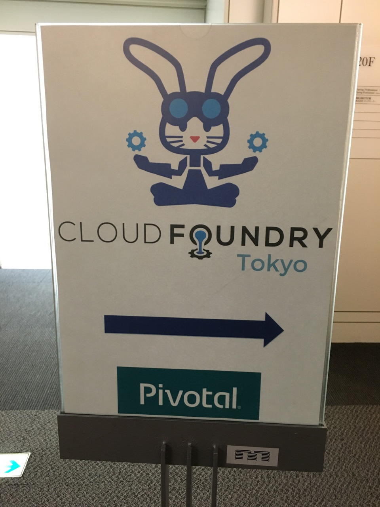

### Cloud Foundry Tokyo Meetup #1

http://www.meetup.com/Cloud-Foundry-Tokyo-Meetup/events/229119655/

## Talk
Introduction to Cloud Foundry (Tomohiro Ichimura, Pivotal)
 * Slide http://www.slideshare.net/TomohiroIchimura/cloud-foundry-introduction-for-cf-meetup-tokyo-march-2016

Route services (Gwenn Etourneau, Pivotal) 
 * Demo & Material https://github.com/shinji62/cf-meetup-tokyo-2016-03-01--1
 * Slideshare   http://www.slideshare.net/gwennetourneau/cloud-foundry-meetup-tokyo-1-route-service

Placement pools without placement pools (Carlo Alberto Ferraris, Rakuten) 
 * Slide http://slides.com/cafxx/the-stack-hack#/
  
Running your application locally with cf local-push (Taichi Nakashima, Rakuten)
 * Slide http://go-talks.appspot.com/github.com/tcnksm/talks/2016/03/cf-meetup/cf-meetup.slide#1

Cloud Foundry Java Client (Toshiaki Maki, Pivotal) 
 * Slide http://www.slideshare.net/makingx/cloud-foundy-java-client-v-20
 * Demo https://github.com/making/demo-cf-java

.NET support update / SteelToe roadmap (Zach Brown, Pivotal)  
 * Slide https://github.com/shinji62/cf-meetup-tokyo-2016-03-01--1/blob/master/dotNET_on_CF-Tokyo_CF_Meetup_3-31-16.pdf

#Picture
 You can find all picture there
https://drive.google.com/open?id=0B6-cY13f0pq6MXhvYldZNTB5ZHc

